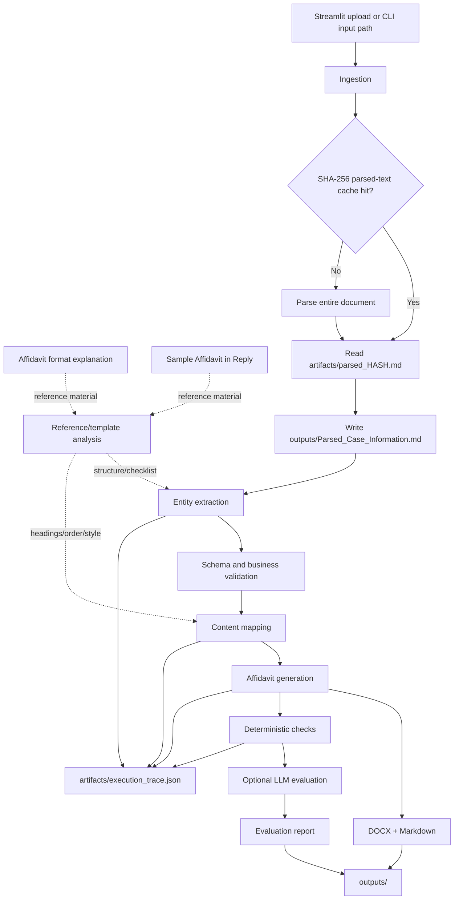

# AI-Powered Legal Document Generation and Evaluation Agent

This project generates and evaluates an **Affidavit in Reply** from uploaded case
information. It extracts a structured intermediate representation, maps the facts
into the required court-document sections, generates Markdown and DOCX outputs, and
applies deterministic and LLM-assisted evaluation checks.

## Architecture



### Workflow stages

1. **Reference/template analysis** — the format explanation is treated as the
   checklist for mandatory sections and entities, while the sample affidavit is
   the structural and formatting reference. These documents should be kept as
   reference inputs and must not be confused with uploaded case-information cache
   files.
2. **Ingestion and caching** — the complete uploaded file is parsed. Its SHA-256
   hash selects `artifacts/parsed_<hash>.md`, allowing identical uploads to reuse
   the parsed content.
3. **Entity extraction** — the case information is converted to the Pydantic
   intermediate representation in `src/schemas/`.
4. **Validation** — required entities and business rules are checked before
   drafting.
5. **Content mapping** — reply points, exhibits, prayer items, parties, deponent,
   jurat, verification, and advocate details are mapped into the reference order.
6. **Generation** — the mapped content produces `Affidavit_in_Reply.md` and
   `Affidavit_in_Reply.docx`.
7. **Evaluation** — case-grounded deterministic checks validate entities,
   reply-point coverage, paragraph content, party/deponent roles, respondent
   consistency, verification range, jurat/deponent agreement, required sections,
   exhibits, and prayer formatting. Optional LLM scoring covers entity accuracy,
   completeness, structure, consistency, template fidelity, and hallucination.
8. **Trace and report persistence** — the latest execution trace is written to
   `artifacts/execution_trace.json`; the latest parsed input, affidavit, and
   evaluation reports are written to `outputs/`.

## Evaluation Strategy

Evaluation uses a **case-grounded, two-layer strategy**. The generated affidavit
is checked against the structured `CaseInformationSchema` extracted from the
uploaded document; it is never evaluated against fixed sample values such as a
hard-coded respondent number, paragraph count, or prayer count.

### 1. Deterministic compliance checks

The deterministic layer runs first and is the authoritative objective baseline.
For a standard case it runs 13 core checks; a supplied deponent organisation adds
one additional organisation-coverage check. The checks are:

- **Exact reply-point coverage** — the body contains exactly one sequentially
  numbered paragraph for every extracted reply point. Missing, extra, or
  incorrectly numbered paragraphs fail this check.
- **Substantive reply-content coverage** — each supplied reply averment/bullet is
  represented in its corresponding generated paragraph; paragraph count alone
  is not sufficient.
- **Verification range** — any stated paragraph range matches the generated body
  paragraph count.
- **Answering respondent consistency** — the extracted answering respondent
  number is used consistently wherever respondent context is stated.
- **Caption party-role consistency** — the extracted petitioner and answering
  respondent appear with the correct caption roles and respondent number.
- **Deponent role consistency** — the deponent is connected to the extracted
  answering respondent.
- **Deponent data coverage** — the supplied deponent name, address, and
  designation appear in the generated document.
- **Case entity coverage** — required court, case number, year, parties, date,
  place, and advocate entities are present.
- **Deponent organisation coverage** — when an organisation is supplied, it is
  identified in the generated document.
- **Prayer coverage** — the `PRAYER` section contains the expected number of
  lettered prayer items.
- **Required section presence** — court heading, case number, affidavit title,
  deponent clause, prayer, and verification sections are present.
- **Attestation verb consistency** — the deponent clause and jurat use verbs
  consistent with the extracted verification instruction.
- **Exhibit reference formatting** — duplicate exhibit markers are rejected.
- **Prayer framing** — prayer items do not repeat the prayer verb or party
  wording already supplied by the prayer preamble.

Each check produces a rule identifier, pass/fail status, expected value, actual
value, and details. Failed checks become findings and are assigned to the
affected scorecard dimension.

### 2. Optional LLM audit

When a configured Gemini or Groq model is available, a second layer audits the
generated document against the same extracted case data and affidavit
conventions. The LLM returns scores for all six dimensions:

- Entity Accuracy
- Completeness
- Structure
- Consistency
- Template Fidelity
- Hallucination Check

It may also report unsupported facts, omissions, inconsistencies, grammar
problems, or template/drafting issues. The LLM layer is supplementary:

- Deterministic checks establish the objective baseline.
- A score below 100 is accepted only when at least one finding is supplied for
  that same dimension.
- Findings are converted into the same severity scale used by deterministic
  checks, and the resulting severity score can only lower the dimension score.
- Invalid JSON, malformed results, unknown dimensions, non-numeric scores, and
  scores outside 0–100 are ignored with a warning.
- An LLM audit cannot increase a deterministic score or conceal a deterministic
  failure.

### 3. Weighted scorecard

The report starts each dimension at 100, applies deterministic deductions for
failed rules, and then applies only supported LLM reductions. Scores are
combined using these weights:

| Dimension | Weight |
| --- | ---: |
| Entity Accuracy | 20% |
| Completeness | 15% |
| Structure | 20% |
| Consistency | 15% |
| Template Fidelity | 15% |
| Hallucination Check | 15% |

Issue severity controls deductions:

| Severity | Deduction |
| --- | ---: |
| CRITICAL | 20 points |
| HIGH | 12 points |
| MEDIUM | 6 points |
| LOW | 3 points |

Scores cannot fall below zero. The final overall score is the weighted sum of
the six dimension scores, rounded to one decimal place. Findings are retained
per dimension and are not automatically deduplicated; a deterministic defect
and an LLM observation may therefore describe the same underlying problem from
different evaluation layers.

### 4. Filing readiness

The numeric score and filing readiness are deliberately separate decisions. The
document is marked:

- **READY** (`filing_ready: true`) only when every deterministic check passes
  and there are no detected deterministic or LLM findings.
- **NOT_READY** otherwise, with `readiness_reasons` listing the findings that
  require attention.

`READY` means **ready for filing review**, not legal approval or a guarantee
that a lawyer will accept the document. A high overall score alone does not
make a document filing-ready.

### 5. Reports and UI

The complete scorecard, deterministic compliance table, detected issues,
readiness status, readiness reasons, and calculation explanation are persisted
as `outputs/Evaluation_Report.json` and `outputs/Evaluation_Report.md`. The
Streamlit Output tab presents the same results through:

- A READY/NOT_READY banner.
- Overall score, checks-passed, findings, and readiness metrics.
- Six dimension scorecards with weights, progress bars, and finding counts.
- A deterministic compliance table showing expected versus actual output.
- Severity-grouped findings and recommended actions.
- Downloads for both the JSON and Markdown reports.

The reference-analysis stage is the intended source of template knowledge. The
format explanation supplies the mandatory-entity/section checklist and glossary,
while the sample affidavit supplies expected ordering, headings, numbering,
prayer, jurat, verification, and advocate-block conventions. Because the
external reference/template files are not currently available, exact
reference-template fidelity cannot be independently proven; the evaluator
currently applies the configured affidavit conventions and deterministic
formatting checks instead.


## Repository structure

```text
├── artifacts/                         # Runtime cache and execution trace
│   ├── parsed_<sha256>.md             # Full parsed text for a unique upload
│   └── execution_trace.json           # Latest ordered workflow trace
├── outputs/                           # Latest generated deliverables
│   ├── Parsed_Case_Information.md
│   ├── Affidavit_in_Reply.md
│   ├── Affidavit_in_Reply.docx
│   ├── Evaluation_Report.json
│   └── Evaluation_Report.md
├── main.py                            # CLI entrypoint
├── src/
│   ├── app.py                         # Streamlit UI
│   ├── graph/
│   │   ├── agent_worfklow.py          # LangGraph nodes and graph compiler
│   │   └── state.py                   # Shared workflow state
│   ├── evals/
│   │   └── scoring.py                 # Deterministic and LLM evaluation
│   ├── schemas/
│   │   ├── entity_schema.py           # Structured case/evaluation models
│   │   └── schema_info.py             # Schema/reference metadata, if present
│   └── utils/
│       ├── parser_utils.py             # Full-document parsing and hash cache
│       ├── docx_generator.py            # Affidavit DOCX rendering
│       └── llm.py                       # Gemini/Groq model factory
├── tests/
│   ├── test_extraction.py              # Schema/extraction tests
│   └── test_validation.py              # Deterministic validation tests
├── .env.example                        # Required environment variable names
├── pyproject.toml                      # Project metadata and dependencies
├── requirements.txt                    # Pip dependency list
└── uv.lock                             # Locked uv dependency resolution
```

## Runtime filesystem contract

`artifacts/` is for reusable parsed-input cache entries and execution tracing.
`outputs/` is for the latest run's user-facing files. The parser must never
silently substitute a default sample case from `artifacts/`.

## Installation Setup

### Prerequisites

- Git
- Python 3.13 or newer
- API key for at least one supported model provider:
  - `GEMINI_API_KEY`, or
  - `GROQ_API_KEY`
- Optional: `LLAMA_CLOUD_API_KEY` for LlamaParse. Local PDF extraction runs as
  a fallback when this key is not configured.

Clone repository and enter project directory:

```bash
git clone https://github.com/Jerry-britto/AI-powered-Legal-Document-Generation-Agent.git
cd AI-powered-Legal-Document-Generation-Agent
```

### Option 1: Install with UV

Install UV if it is not already available:

```bash
pip install uv
```

Create project environment and install locked dependencies:

```bash
uv sync
```

UV creates and manages project virtual environment in `.venv`. Run commands
through UV:

```bash
uv run streamlit run src/app.py
```

For CLI usage:

```bash
uv run python main.py gemini none path/to/case-information.pdf
```

### Option 2: Install with Python virtual environment

Create virtual environment:

```bash
python3.13 -m venv .venv
```

Activate environment.

macOS or Linux:

```bash
source .venv/bin/activate
```

Windows PowerShell:

```powershell
.venv\Scripts\Activate.ps1
```

Upgrade pip and install dependencies:

```bash
python -m pip install --upgrade pip
python -m pip install -r requirements.txt
```

Copy environment template:

macOS or Linux:

```bash
cp .env.example .env
```

Windows PowerShell:

```powershell
Copy-Item .env.example .env
```

Open `.env` and set `GEMINI_API_KEY` or `GROQ_API_KEY`. Set
`LLAMA_CLOUD_API_KEY` when using LlamaParse.

Start Streamlit application:

```bash
streamlit run src/app.py
```

Run CLI:

```bash
python main.py gemini none path/to/case-information.pdf
```

Replace `gemini` with `groq` when using Groq. Replace
`path/to/case-information.pdf` with uploaded case-information file path.

Deactivate virtual environment after use:

```bash
deactivate
```
