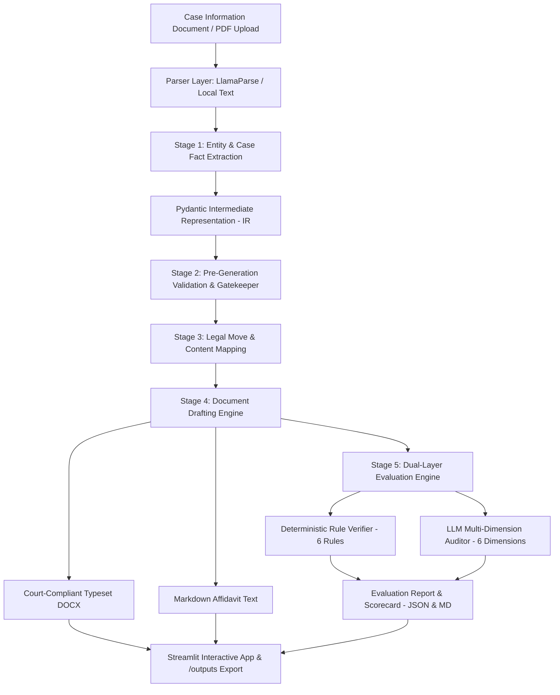

# AI-Powered Legal Document Generation & Evaluation Agent

An automated, production-grade legal document generation and evaluation system specialized for Indian High Court litigation (focusing on the **Affidavit in Reply** for Writ Petitions). The agent ingests unstructured or semi-structured case information documents, extracts key legal entities into an intermediate Pydantic schema, maps substantive points to High Court drafting moves, generates a court-typeset Affidavit in Reply (`.docx` and Markdown), and performs dual-layer evaluation combining zero-tolerance deterministic rule checking with LLM multi-dimensional quality scoring.

---

## Key Highlights & Deliverables
- **Core Technology Stack**: Python 3.12+, LangChain, LangGraph state machine, LlamaParse (`llama_cloud`), Groq (`ChatGroq`), Google Gemini (`ChatGoogleGenerativeAI`), Pydantic v2, and Streamlit.
- **Dual Validation Pipeline**:
  1. *Pre-generation Schema Validation*: Enforces entity consistency, mandatory authority deponent designation, and proper verification verbs prior to drafting.
  2. *Post-generation Evaluation Engine*: Programmatically validates 6 zero-tolerance High Court rules (verification paragraph range agreement, jurat/deponent verb alignment, answering respondent number consistency, organization officer deposition, presence of all 10 mandatory sections, and lettered prayer distinction) plus LLM scoring across 6 dimensions.
- **Interactive Streamlit Web UI**: Single-file upload interface, 1-click test with pre-loaded sample data, model switcher (Gemini vs. Groq), interactive scorecard, and export to `.docx`, `.json`, and `.md`.
- **Demo / Audit Simulation Mode**: Integrated toggle to inject formatting edge cases (such as mismatched paragraph ranges or altered respondent numbers) to demonstrate how the validation layer identifies and isolates defects in real time.

---

## System Architecture



---

## Repository Structure

```
├── .env.example                  # Environment variable template
├── pyproject.toml                # Project metadata and dependencies
├── requirements.txt              # Pip requirements
├── main.py                       # CLI execution script
├── README.md                     # Project documentation
│   artifacts/                    # Ground truth reference documents and sample case info
│   ├── 01_Affidavit_format_explained.md
│   ├── 02_Affidavit_in_reply_sample.md
│   └── 03_Case_Information.md
├── outputs/                      # Final assignment submission deliverables
│   ├── Affidavit_in_Reply.docx   # Court-compliant formatted Affidavit (.docx)
│   ├── Affidavit_in_Reply.md     # Generated Affidavit text (.md)
│   ├── Evaluation_Report.json    # Complete JSON evaluation metrics and issue list
│   └── Evaluation_Report.md      # Formatted Markdown evaluation report
├── src/
│   ├── app.py                    # Streamlit web application
│   ├── evals/
│   │   └── scoring.py            # Dual-layer deterministic & LLM evaluation engine
│   ├── graph/
│   │   ├── agent_worfklow.py     # LangGraph compilation & workflow nodes
│   │   └── state.py              # TypedDict agent workflow state
│   ├── schemas/
│   │   └── entity_schema.py      # Pydantic schemas (IR & evaluation models)
│   └── utils/
│       ├── docx_generator.py     # High Court DOCX styling and layout generator
│       ├── llm.py                # LangChain LLM factory (Groq & Gemini)
│       └── parser_utils.py       # LlamaParse & fallback document ingestion
└── tests/
    ├── test_extraction.py        # Unit tests for schema validation
    └── test_validation.py        # Unit tests for deterministic rule enforcement
```

---

## Setup & Installation

### Prerequisites
- Python 3.12 or 3.13
- `uv` (recommended) or standard `pip`

### 1. Clone the Repository
```bash
git clone https://github.com/Jerry-britto/AI-powered-Legal-Document-Generation-Agent.git
cd AI-powered-Legal-Document-Generation-Agent
```

### 2. Configure Environment Variables
Create a `.env` file in the root directory:
```bash
cp .env.example .env
```
Populate `.env` with your API keys:
```ini
GROQ_API_KEY=your_groq_api_key_here
GEMINI_API_KEY=your_gemini_api_key_here
LLAMA_CLOUD_API_KEY=your_llama_cloud_api_key_here
```

### 3. Install Dependencies
Using `uv`:
```bash
uv sync
```
Or using standard `pip`:
```bash
python3 -m venv .venv
source .venv/bin/activate
pip install -r requirements.txt
pip install python-docx
```

---

## How to Run

### Option A: Interactive Streamlit Web UI
To launch the user-friendly interface:
```bash
streamlit run src/app.py
```
Open your browser at `http://localhost:8501`.
- **Title & Subtitle**: `AI-Powered Legal Document Generation Agent`.
- **Two Simple Controls**:
  1. `Upload the Case Information (PDF)`
  2. `Execute / Run Agent` button
- **Execution Step Progress**: Shows live stage progression (Ingestion, Entity Extraction, Pre-Gen Validation, Move Mapping, Drafting, Dual Evaluation).
- **Two Result Tabs**:
  1. **Final Document: Affidavit in Reply** (with court typeset display and `.docx` download).
  2. **Evaluation Report** (scorecard, 6 deterministic rule check results, and `.json` download).

### Option B: Command-Line Interface (CLI)
Run the agent pipeline end-to-end directly from your terminal:
```bash
# Standard clean generation with Gemini
python main.py gemini none

# Standard clean generation with Groq
python main.py groq none

# Run with intentional error simulation (e.g. paragraph range discrepancy)
python main.py gemini corrupt_paragraph_range
```

### Option C: Run Unit Tests
```bash
python -m unittest tests/test_validation.py
python -m unittest tests/test_extraction.py
```

---

## Working Link & Video Demo

- **Live Application Link**: [Streamlit Cloud / Deployment URL Placeholder](http://localhost:8501) *(Configure in Streamlit Community Cloud or Hugging Face Spaces)*
- **Walkthrough Video Demo (< 5 min)**: [Loom / Google Drive Video Link Placeholder](https://drive.google.com/)
  - *Video breakdown*:
    - **0:00 - 1:30**: Introduction and ingestion of `03 Case_Information.pdf`.
    - **1:30 - 3:00**: End-to-end execution showing intermediate entity extraction, mapping to High Court structural moves, and generated typeset `.docx`.
    - **3:00 - 4:00**: Evaluation report analysis (100/100 score, zero hallucinations, all 6 deterministic rules passed).
    - **4:00 - 5:00**: Validation layer demonstration: Activating the Demo Simulation mode to inject a paragraph range mismatch, showing how the deterministic engine catches the defect, drops consistency to 80%, and flags the exact citation.

---

## Design Decisions & Trade-Offs

### 1. LangGraph State Machine vs. Monolithic Prompting
- **Decision**: Orchestrated the workflow using **LangGraph** with discrete nodes for extraction, pre-validation, content mapping, drafting, and dual evaluation.
- **Rationale**: Legal document drafting requires strict structural guarantees. A monolithic prompt asking an LLM to "extract and write an affidavit in one step" frequently suffers from paragraph count drift, missing sections, and formatting hallucinations. Separating extraction into a validated Pydantic schema guarantees 100% entity fidelity before drafting begins.
- **Rejected Alternative**: Single zero-shot prompt generation.

### 2. Dual-Layer Evaluation (Deterministic Rule Engine + LLM Auditor)
- **Decision**: Built programmatic, zero-tolerance deterministic checkers alongside an LLM qualitative judge.
- **Rationale**: High Court filings have rigid procedural rules where a single error (e.g., deponent solemnly affirms in Part 6 but jurat says "Sworn" in Part 9, or verification states "paragraphs 1 to 5" when the body has 7 paragraphs) causes the filing to be rejected by the registry. These checks must have zero tolerance and cannot depend on probabilistic LLM judgment alone.
- **Rejected Alternative**: Relying solely on an LLM-as-a-judge prompt.

### 3. Pydantic Intermediate Representation (IR) with Pre-Generation Validation
- **Decision**: Implemented `CaseInformationSchema` as an explicit intermediary between raw case input and document drafting.
- **Rationale**: Enforces legal constraints before any drafting LLM call: for instance, verifying that an organisation deponent has an explicit official designation (cannot declare "I am Respondent No. 2"), and maintaining traceability back to source text.
- **Rejected Alternative**: Passing freeform dictionaries between pipeline steps.

### 4. High-Court Specific DOCX Generation
- **Decision**: Implemented `docx_generator.py` using standard legal styling: 1.25" left margin, Times New Roman 12pt, 1.35 line spacing, 2-column cause title with right-aligned party status tags (`...Petitioner`), and right-aligned `DEPONENT` jurat blocks.
- **Rationale**: Ensures the output is directly usable for court submission rather than requiring manual typesetting.

---

## Known Limitations & Failure Cases

1. **Scanned Documents with Poor OCR Quality**: If an uploaded PDF has low-resolution scans, text extraction may omit specific dates or exhibit letters without advanced visual OCR preprocessing.
2. **Multi-Deponent Joint Affidavits**: The current system is tailored for a single answering respondent filing an Affidavit in Reply. Matters requiring joint deponents across multiple respondents would require dynamic jurat expansion.
3. **Complex Para-Wise Replies**: Consistent with the assignment scope (Section 5), para-wise itemized replies answering petitions paragraph-by-paragraph are out of scope and would require dynamic petition alignment.

---

## AI Coding Assistant Disclosure

This project was architected, implemented, and verified with the assistance of **Antigravity (Google DeepMind)**, utilizing agentic planning, automated code editing, and continuous terminal verification.