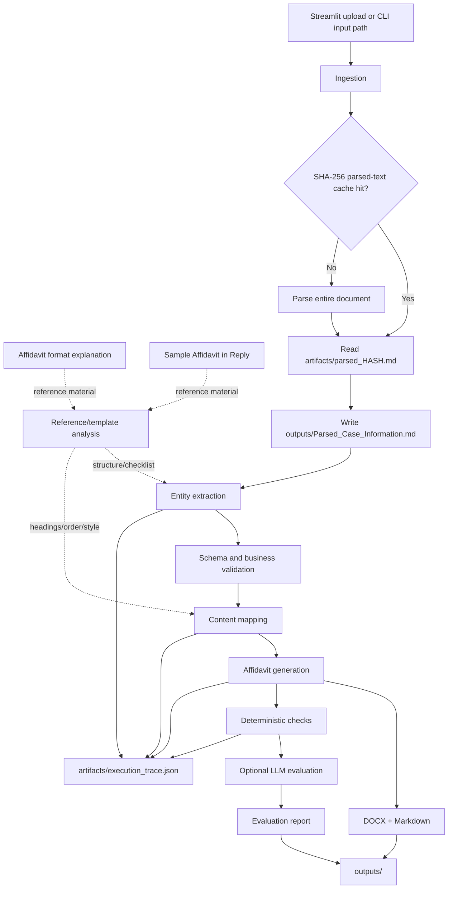

# AI-Powered Legal Document Generation and Evaluation Agent

This project generates and evaluates an **Affidavit in Reply** from uploaded case
information. It extracts a structured intermediate representation, maps the facts
into the required court-document sections, generates Markdown and DOCX outputs, and
applies deterministic and LLM-assisted evaluation checks.

## Architecture



### Workflow stages

1. **Reference/template analysis** — the format explanation is treated as the
   checklist for mandatory sections and entities, while the sample affidavit is
   the structural and formatting reference. These documents should be kept as
   reference inputs and must not be confused with uploaded case-information cache
   files.
2. **Ingestion and caching** — the complete uploaded file is parsed. Its SHA-256
   hash selects `artifacts/parsed_<hash>.md`, allowing identical uploads to reuse
   the parsed content.
3. **Entity extraction** — the case information is converted to the Pydantic
   intermediate representation in `src/schemas/`.
4. **Validation** — required entities and business rules are checked before
   drafting.
5. **Content mapping** — reply points, exhibits, prayer items, parties, deponent,
   jurat, verification, and advocate details are mapped into the reference order.
6. **Generation** — the mapped content produces `Affidavit_in_Reply.md` and
   `Affidavit_in_Reply.docx`.
7. **Evaluation** — deterministic checks validate respondent consistency,
   verification range, jurat/deponent agreement, required sections, organisation
   deponent wording, and prayer formatting. Optional LLM scoring covers entity
   accuracy, completeness, structure, consistency, template fidelity, and
   hallucination.
8. **Trace and report persistence** — the latest execution trace is written to
   `artifacts/execution_trace.json`; the latest parsed input, affidavit, and
   evaluation reports are written to `outputs/`.

The reference-analysis stage is the intended source of template knowledge. The
format explanation supplies the mandatory-entity/section checklist and glossary,
while the sample affidavit supplies the expected ordering, headings, numbering,
prayer, jurat, verification, and advocate-block conventions. The current code
still implements some of these conventions in the schema, generator, and
evaluator, so dynamic loading of the two reference files remains a follow-up
integration step rather than an already-complete behavior.


## Repository structure

```text
├── artifacts/                         # Runtime cache and execution trace
│   ├── parsed_<sha256>.md             # Full parsed text for a unique upload
│   └── execution_trace.json           # Latest ordered workflow trace
├── outputs/                           # Latest generated deliverables
│   ├── Parsed_Case_Information.md
│   ├── Affidavit_in_Reply.md
│   ├── Affidavit_in_Reply.docx
│   ├── Evaluation_Report.json
│   └── Evaluation_Report.md
├── main.py                            # CLI entrypoint
├── src/
│   ├── app.py                         # Streamlit UI
│   ├── graph/
│   │   ├── agent_worfklow.py          # LangGraph nodes and graph compiler
│   │   └── state.py                   # Shared workflow state
│   ├── evals/
│   │   └── scoring.py                 # Deterministic and LLM evaluation
│   ├── schemas/
│   │   ├── entity_schema.py           # Structured case/evaluation models
│   │   └── schema_info.py             # Schema/reference metadata, if present
│   └── utils/
│       ├── parser_utils.py             # Full-document parsing and hash cache
│       ├── docx_generator.py            # Affidavit DOCX rendering
│       └── llm.py                       # Gemini/Groq model factory
├── tests/
│   ├── test_extraction.py              # Schema/extraction tests
│   └── test_validation.py              # Deterministic validation tests
├── .env.example                        # Required environment variable names
├── pyproject.toml                      # Project metadata and dependencies
├── requirements.txt                    # Pip dependency list
└── uv.lock                             # Locked uv dependency resolution
```

## Runtime filesystem contract

`artifacts/` is for reusable parsed-input cache entries and execution tracing.
`outputs/` is for the latest run's user-facing files. The parser must never
silently substitute a default sample case from `artifacts/`.

## Running locally

```bash
uv sync
cp .env.example .env
streamlit run src/app.py
```

For the CLI:

```bash
python main.py gemini none path/to/case-information.pdf
```

Set `GEMINI_API_KEY` or `GROQ_API_KEY` for model-backed extraction/evaluation.
`LLAMA_CLOUD_API_KEY` is optional; local PDF extraction is used as a fallback.
